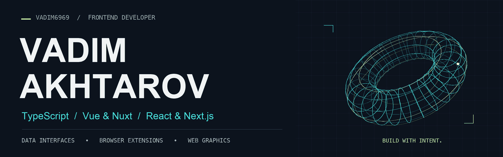
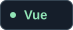
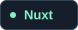
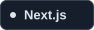

<picture>
  <source media="(prefers-reduced-motion: reduce)" srcset="./assets/banner.png">
  
</picture>

<h2>Привет, я Вадим 👋</h2>

<strong>Frontend-разработчик · 6+ лет коммерческого опыта · Санкт-Петербург</strong>

Создаю интерфейсы, которые помогают разобраться в сложных данных: аналитические дашборды, таблицы, графики и карты. Работаю с Vue и React, разрабатываю браузерные расширения и люблю интерактивную веб-графику.

<a href="mailto:ahtarovvadim@gmail.com"><strong>Написать мне ↗</strong></a> &nbsp; · &nbsp; <a href="https://github.com/Vadim6969/myCv/blob/main/assets/akhtarov-vadim-cv.pdf"><strong>Резюме PDF ↗</strong></a>

<h2>Чем занимаюсь</h2>

<ul>
  <li><strong>Интерфейсы данных:</strong> AG Grid, ECharts, ApexCharts, WebSocket и Socket.io.</li>
  <li><strong>Браузерные расширения:</strong> разработка и перенос расширений на WXT.</li>
  <li><strong>Качество frontend:</strong> дизайн-системы, Storybook, тесты, код-ревью и рефакторинг легаси.</li>
  <li><strong>Графика и карты:</strong> Three.js, Pixi.js, Canvas, OpenLayers и Leaflet.</li>
</ul>

В моём опыте — основной сервис и браузерное расширение <strong>MPSTATS</strong>, SPA/SSR-приложения в <strong>RuNetSoft</strong>, руководство небольшой командой и участие в найме.

<h2>Основной стек</h2>

  
  
  
  
  
  

<strong>Состояние и сборка:</strong> Pinia · Vuex · Redux Toolkit · Vite · Webpack 
<strong>UI и проверка:</strong> Tailwind CSS · Sass · Storybook · Vitest · Jest · Playwright

<h2>Открытые проекты</h2>

<h3>01 / <a href="https://github.com/Vadim6969/testovoeThreeJs">Интерактивная 3D-сцена ↗</a></h3>

Параметрическая модель двери, анимированные геометрические объекты, освещение, тени и отражения. Управление камерой через OrbitControls. 
Vue 3 · TypeScript · Three.js · Vite &nbsp; / &nbsp; Тестовый проект

<h3>02 / <a href="https://github.com/Vadim6969/testovoveEmployCity">Каталог товаров ↗</a></h3>

Поиск и фильтрация, загрузка товаров из API, подробная карточка с галереей и QR-кодом. Состояние каталога хранится в Pinia. 
Nuxt 3 · TypeScript · Pinia &nbsp; / &nbsp; Тестовый проект

<h3>03 / <a href="https://github.com/Vadim6969/myCv">Сайт-резюме ↗</a></h3>

Одностраничное резюме с опытом, технологиями, контактами и PDF-версией. Статический сайт без этапа сборки. 
HTML · CSS · JavaScript &nbsp; / &nbsp; Личный проект

<strong>Есть интересная frontend-задача?</strong> <a href="mailto:ahtarovvadim@gmail.com">Давай обсудим ↗</a>

